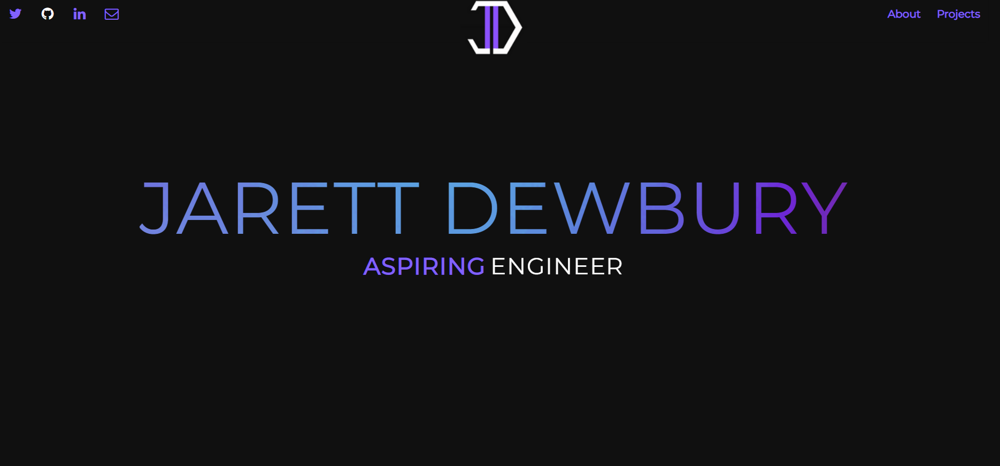
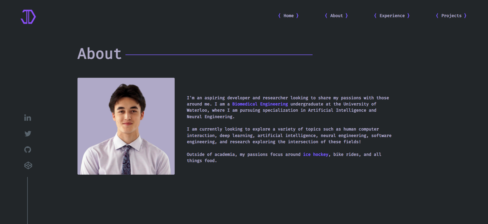
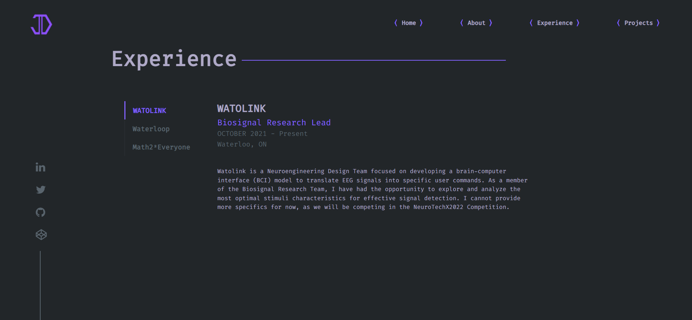

# Old-Website-Model
Old Personal Portfolio website
This was used as an opportunity to teach myself basic web dev concepts and get some intro experience
 
Front Page:

 
About Section:

  
Here is my second iteration built from scratch
 
 
 
